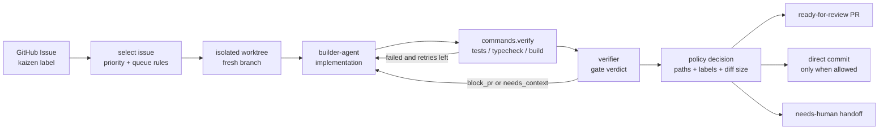
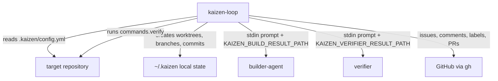

# kaizen-loop

`kaizen-loop` is the local TypeScript CLI that coordinates Kaizen Agents work from GitHub Issues to ready-for-review pull requests.

It owns orchestration, not implementation quality by itself: it selects issues, prepares isolated workspaces, invokes `builder-agent`, runs repository verification commands, invokes `verifier`, applies repository policy, and reports the result back to GitHub.

## What It Does

The Phase 2 implementation supports builder-agent-based fixes, verifier review, isolated per-issue git worktrees, parallel issue processing, PR-first reflection followed by the vendored `pr-guardian` skill, explicit hybrid/direct reflection opt-ins when verifier is disabled, verification retries, YAML-configured scheduler jobs, opt-in issue queueing, user-triggered backlog improvement runs, and basic operational commands. `kaizen watch` remains a later-phase feature.

## Canonical repositories

Issues and pull requests for this project are tracked in `kaizen-agents-org/kaizen-loop`. Local development checkouts should use the org repository as their source-of-truth remote. Personal forks are fine as additional contributor remotes, but they are not the canonical issue/PR location.

The current CLI supports the issue-to-PR loop used by Kaizen Agents:



The runtime behavior is controlled by `.kaizen/config.yml` in each target repository. See [docs/03-config-spec.md](./docs/03-config-spec.md) for the full schema.

## Component Boundaries



## Commands

| Command | Purpose |
|---|---|
| `kaizen init` | Install `.kaizen/config.yml`, issue template, labels, registry entry, workspace, and default scheduler registration. Use `kaizen scheduler sync` to re-sync or repair scheduler jobs. |
| `kaizen run` | Run the maintenance pipeline once. Use `--dry-run` to inspect issue selection without modifying workspaces or GitHub. |
| `kaizen fix <issue>` | Process one existing issue immediately with the same safety gates as scheduled runs. |
| `kaizen report <title>` | Create a Kaizen issue; `--now` creates and immediately processes it. |
| `kaizen smoke` | Run a controlled sandbox issue-to-PR smoke pass and save readiness artifacts. |
| `kaizen queue` / `kaizen unqueue` | Add or remove queued execution approval labels for opt-in selection mode. |
| `kaizen improve` | Plan and run an immediate improvement pass over selected or queued issues. |
| `kaizen goal` | Create and run a multi-iteration goal that plans scoped issues, processes them, evaluates progress, and stops when done or blocked. |
| `kaizen status` | Show registry state and latest run summary. Use `--metrics` for aggregate counters. |
| `kaizen scheduler` | Inspect, update, sync, and disable scheduled jobs. |
| `kaizen fleet` | Rebuild registry, workspaces, labels, scheduler jobs, and optionally verify fleet workspaces after upgrading Kaizen Loop. |
| `kaizen logs` | Print latest or selected run logs from `~/.kaizen`. |
| `kaizen doctor` | Check local setup, required labels, workspaces, and external commands. |
| `kaizen list` | List registered projects. |
| `kaizen watch` | Reserved for Phase 4; currently returns a not-implemented error. |

Most commands accept `--project <slug>` and `--json`. `run`, `fix`, and `improve` accept `--agent claude|codex` to override the repository default for the current run.

## Quickstart

```sh
npm install
npm test
npm run typecheck
npm run build
```

For local CLI development without installing the package:

```sh
npm run dev -- --help
npm run dev -- run --dry-run --json
```

For a target repository:

```sh
kaizen init --agent codex --schedule 02:00
kaizen scheduler sync
kaizen doctor
kaizen report "Fix stale config reload" --body "Observed during local dogfooding" --priority P2 --queue
kaizen run --dry-run
kaizen fix 42 --json
kaizen smoke --project sandbox-repo --yes --json
kaizen goal create "Improve onboarding reliability" --success "npm test and npm run typecheck pass" --json
kaizen goal run <goal-id> --yes --json
```

For this repository's own dogfooding loop:

```sh
npm run dogfood:sync
npm run dogfood:verify
```

## Runtime Requirements

The CLI delegates external work instead of embedding tokens or provider SDKs:

- `git` for workspace, branch, diff, commit, push, and worktree operations.
- `gh` for issue, label, comment, and PR operations.
- `builder-agent` on `PATH` when `.kaizen/config.yml` uses the default builder command.
- `verifier` on `PATH` when `verifier.enabled: true`.
- `codex` for the PR guardian workflow when `guardian.enabled: true`.

`KAIZEN_HOME` may be set to override the default local state directory (`~/.kaizen`). The local state contains the registry, project workspaces, locks, logs, and latest run summaries; it should not be committed to target repositories.

## Repository Contract

Target repositories opt in through committed configuration:

```yaml
version: 1
commands:
  setup: "npm ci"
  verify:
    - "npm test"
    - "npm run typecheck"
policy:
  mode: pr-only
```

The important contract points are:

- `commands.setup` runs after workspace reset and before issue branches are prepared.
- `commands.verify` is the mechanical gate; every command must pass before PR/direct reflection continues.
- `builder.command` receives the issue prompt on stdin and writes `builder.resultPath`.
- `verifier.command` receives a verifier prompt on stdin and writes `verifier.resultPath`.
- The intake gate treats issues as evidence, not orders: unsupported source-of-truth syncs, guardrail regressions, missing context, and already-covered work are commented and skipped before builder-agent runs.
- `guardian.command` runs the vendored `pr-guardian` workflow after PR creation; `guardian.mode: async` persists resumable jobs under `~/.kaizen/projects/<slug>/guardian/jobs/`, while unresolved, non-outdated review threads keep the guardian loop running up to `guardian.maxAttempts`.
- `safety.minFreeDiskMb` and `safety.envAllowlist` control workspace preflight capacity and the environment exposed to shell, builder, verifier, guardian, and goal commands.
- `policy.mode`, protected paths, forbidden paths, labels, diff size, and verifier output decide whether the result becomes a PR, a direct commit, or a human handoff.

## Documentation

Start with [docs/README.md](./docs/README.md). The most useful implementation-facing references are:

- [docs/02-cli-spec.md](./docs/02-cli-spec.md): command behavior and options.
- [docs/03-config-spec.md](./docs/03-config-spec.md): `.kaizen/config.yml` schema.
- [docs/04-nightly-pipeline.md](./docs/04-nightly-pipeline.md): run pipeline and retry behavior.
- [docs/07-safety.md](./docs/07-safety.md): guardrails, locks, protected paths, and failure modes.
- [docs/09-instant-run.md](./docs/09-instant-run.md): `fix`, `report --now`, and `improve`.
- [docs/10-skills.md](./docs/10-skills.md): shared Kaizen skills vendored into target repositories.
- [docs/11-goals.md](./docs/11-goals.md): Goal runner behavior and agent-facing contract.
- [docs/13-sandbox-smoke.md](./docs/13-sandbox-smoke.md): controlled sandbox smoke runs and readiness artifacts.
