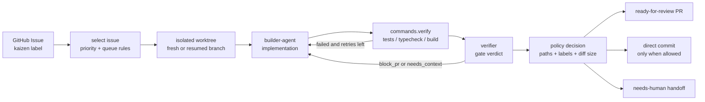
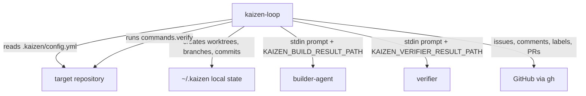

# kaizen-loop

`kaizen-loop` is the local TypeScript CLI that coordinates Kaizen Agents work from GitHub Issues to ready-for-review pull requests.

It owns orchestration, not implementation quality by itself: it selects issues, prepares isolated workspaces, invokes `builder-agent`, runs repository verification commands, invokes `verifier`, applies repository policy, and reports the result back to GitHub.

## What It Does

The Phase 2 implementation supports builder-agent-based fixes, verifier review, resumable per-issue git worktrees and checkpoint draft PRs, parallel issue processing, PR-first reflection followed by the vendored `pr-guardian` skill, explicit hybrid/direct reflection opt-ins when verifier is disabled, verification retries, YAML-configured scheduler jobs, opt-in issue queueing, user-triggered backlog improvement runs, and operational status commands. `kaizen watch` remains a later-phase feature.

## Canonical repositories

Issues and pull requests for this project are tracked in `kaizen-agents-org/kaizen-loop`. Local development checkouts should use the org repository as their source-of-truth remote. Personal forks are fine as additional contributor remotes, but they are not the canonical issue/PR location.

The current CLI supports the issue-to-PR loop used by Kaizen Agents:


```mermaid
flowchart LR
    Issue["GitHub Issue<br/>kaizen label"] --> Select["select issue<br/>priority + queue rules"]
    Select --> Workspace["isolated worktree<br/>fresh or resumed branch"]
    Workspace --> Builder["builder-agent<br/>implementation"]
    Builder --> Verify["commands.verify<br/>tests / typecheck / build"]
    Verify --> Gate["verifier<br/>gate verdict"]
    Gate --> Policy["policy decision<br/>paths + labels + diff size"]
    Policy --> PR["ready-for-review PR"]
    Policy --> Direct["direct commit<br/>only when allowed"]
    Policy --> Human["needs-human handoff"]

    Verify -->|failed and retries left| Builder
    Gate -->|block_pr or needs_context| Builder
```

The runtime behavior is controlled by `.kaizen/config.yml` in each target repository. See [docs/03-config-spec.md](./docs/03-config-spec.md) for the full schema.

## Component Boundaries


```mermaid
flowchart TB
    KL["kaizen-loop"]
    BA["builder-agent"]
    VF["verifier"]
    GH["GitHub via gh"]
    FS["~/.kaizen local state"]
    Repo["target repository"]

    KL -->|"reads .kaizen/config.yml"| Repo
    KL -->|"creates worktrees, branches, commits"| FS
    KL -->|"stdin prompt + KAIZEN_BUILD_RESULT_PATH"| BA
    KL -->|"runs commands.verify"| Repo
    KL -->|"stdin prompt + KAIZEN_VERIFIER_RESULT_PATH"| VF
    KL -->|"issues, comments, labels, PRs"| GH
```

## Commands

| Command | Purpose |
|---|---|
| `kaizen init` | Install `.kaizen/config.yml`, issue template, labels, registry entry, workspace, and default scheduler registration. Use `kaizen scheduler sync` to re-sync or repair scheduler jobs. |
| `kaizen run` | Run the maintenance pipeline once. Use `--dry-run` to inspect issue selection without modifying workspaces or GitHub. |
| `kaizen fix <issue>` | Process one existing issue immediately with the same safety gates as scheduled runs. |
| `kaizen report <title>` | Create a Kaizen issue; `--now` creates and immediately processes it. |
| `kaizen smoke` | Run a controlled sandbox issue-to-PR smoke pass and save readiness artifacts. |
| `kaizen queue` / `kaizen unqueue` | Add or remove queued execution approval labels for opt-in selection mode. |
| `kaizen improve` | Plan and run an immediate improvement pass over selected or queued issues. |
| `kaizen goal` | Create and run a multi-iteration goal that plans scoped issues, processes them, evaluates progress, and stops when done or blocked. |
| `kaizen status` | Show registry state and latest run summary. Use `--metrics` for aggregate counters. |
| `kaizen scheduler` | Inspect, update, sync, and disable scheduled jobs. |
| `kaizen fleet` | Rebuild registry, workspaces, labels, scheduler jobs, and optionally verify fleet workspaces after upgrading Kaizen Loop. |
| `kaizen logs` | Print latest or selected run logs from `~/.kaizen`. |
| `kaizen doctor` | Check local setup, required labels, private workspace permissions, and external commands; `--repair` restores managed directories to `0700`. |
| `kaizen list` | List registered projects. |
| `kaizen watch` | Reserved for Phase 4; currently returns a not-implemented error. |

Most commands accept `--project <slug>` and `--json`. `run`, `fix`, and `improve` accept `--agent claude|codex` to override the repository default for the current run.

Scheduler synchronization installs a stable operator launcher at
`$KAIZEN_HOME/bin/kaizen` when the configured immutable scheduled launcher is
`run-scheduled.sh`. It does not create or replace the operator-managed scheduled
wrapper. Use the stable launcher for `doctor`, `fleet`,
monitor checks, and other operator commands; add `$KAIZEN_HOME/bin` before global
npm locations on `PATH` if the short `kaizen` command is required. Both operator
and scheduled commands refresh a dedicated runtime clone under
`$KAIZEN_HOME/runtime/kaizen-loop` from the ref selected by `KAIZEN_RUNTIME_REF`
(`main` by default). Because `dist/` is committed,
a refresh normally installs runtime dependencies and runs the CLI that ships with
the commit; it builds only when the checked-out commit has no `dist/`. The clone is
hard-reset to the target ref, so it is disposable build output and never a developer
checkout. An update or build failure stops the scheduled run or operator command
instead of silently using stale code. `doctor --json` and `fleet --json` include the
selected runtime commit and directory.

`dist/` is committed so that `npm install -g "github:kaizen-agents-org/kaizen-loop#<tag>"`
yields a working CLI with no build step on the adopter's machine. `npm run check:dist`
rebuilds and fails when the committed output is stale; CI runs it on every change.
Run `npm run build` and commit the regenerated files when it reports a difference.

`KAIZEN_RUNTIME_REF` selects which upstream ref that clone follows. It defaults to
`main`, which is what dogfood repositories want: they exercise unreleased code on
purpose. External adopters set it to the release tag pinned by
`onboarding/versions.json` (for example `v0.1.0`), so a scheduled run cannot pick
up code that has not been released. A value starting with `v` is fetched and
checked out as a tag; anything else is followed as a branch.

The pinned installer also records the installed Verifier version under
`$KAIZEN_HOME/toolchain/verifier/.installed-version`. `kaizen init` carries that
version into `.kaizen/config.yml` as `verifier.expectedRef: refs/tags/<version>`,
so freshness is checked against the installed release set rather than moving
`main`. Existing installs without the stamp retain the `refs/heads/main` default.

## Quickstart

```sh
npm install
npm test
npm run typecheck
npm run build
```

For local CLI development without installing the package:

```sh
npm run dev -- --help
npm run dev -- run --dry-run --json
```

For a target repository:

Set `GH_TOKEN` or `GITHUB_TOKEN` only for credential-only `init`, `actions prepare`,
and `actions publish` phases. Builder-capable commands reject ambient token variables
because same-UID child processes can recover the original environment through procfs.
For scheduled local HTTPS publication, install the
[root-owned macOS publication broker](./docs/16-macos-publication-broker.md). Its
LaunchDaemon starts the exact scheduled supervisor, binds authorization to that PID
and macOS audit token, and rejects builder/verifier descendants even when they use the
same Node executable. Kaizen connects only after builder and verifier processes exit
and sends the temporary bare-repository path, HTTPS URL, refspec, expected repository,
expected commit SHA, and optional force-with-lease value. The broker imports the bare
repository as the unprivileged runtime user, then takes ownership, removes untrusted
Git configuration, revalidates the repository and SHA, performs the authenticated Git
push under its separate root identity, and returns only a boolean acknowledgement.
Authenticated GitHub CLI operations also run inside the root broker, from `/var/empty`,
using a fixed administrator-owned `gh`; only bounded output and exit status return to
Kaizen. The token never enters a Kaizen or same-UID child environment. Publication
uses a 30-minute absolute broker publication deadline by default; pass
`--publication-timeout-ms` to the installer to set 10000–3600000 ms.
The broker treats socket disconnect as cancellation and terminates its import/push
process group. Because a remote may accept a Git update immediately before a local
disconnect, an unacknowledged publication is reported as an ambiguous failure and is
not automatically retried.
Publication rejects refs containing Git LFS pointers because it cannot safely run repository
pre-push hooks or upload LFS objects with a separate trusted credential path.
Broker-backed jobs are registered with a time in the root-owned installer configuration.
The installer creates a system LaunchDaemon dispatcher; do not create a duplicate user
LaunchAgent with `scheduler sync` for those jobs. Scheduled HTTPS publication starts a
fully root-owned runtime chain and injects the socket only after the root dispatcher has
authorized the registered job.

```sh
sudo install -d -o root -g wheel -m 0755 /Library/Application\ Support/KaizenLoop
sudo install -o root -g wheel -m 0600 /path/to/github-app-private-key.pem \
  /Library/Application\ Support/KaizenLoop/github-app-private-key.pem
# Install a standalone administrator-owned gh outside the broker-managed runtime root.
sudo install -d -o root -g wheel -m 0755 /usr/local/libexec/kaizen-gh
sudo install -o root -g wheel -m 0755 /path/to/standalone/gh /usr/local/libexec/kaizen-gh/gh
sudo scripts/install-macos-publication-broker.sh \
  --runtime-user "$USER" \
  --github-app-id 12345 \
  --github-app-installation-id 67890 \
  --github-app-private-key-file /Library/Application\ Support/KaizenLoop/github-app-private-key.pem \
  --repository owner/repo \
  --scheduled-job owner-repo/maintenance@02:00 \
  --tool-path "/usr/local/libexec/kaizen-gh:/usr/local/bin:/usr/bin:/bin" \
  --github-cli /usr/local/libexec/kaizen-gh/gh \
  --node "$(command -v node)" \
  --npm "$(command -v npm)"
export PATH=/usr/local/libexec/kaizen-gh:$PATH
kaizen init --agent codex --schedule 02:00
export PATH="${KAIZEN_HOME:-$HOME/.kaizen}/bin:$PATH"
kaizen doctor
kaizen report "Fix stale config reload" --body "Observed during local dogfooding" --priority P2 --queue
kaizen run --dry-run
kaizen fix 42 --json
kaizen smoke --project sandbox-repo --yes --json
kaizen goal create "Improve onboarding reliability" --success "npm test and npm run typecheck pass" --json
kaizen goal run <goal-id> --yes --json
```

After upgrading from a user LaunchAgent installation, remove the duplicate user job and
install the root broker/dispatcher registration above. Re-run the installer whenever a
registered time, job, tool path, or publication timeout changes. Each run must include
the complete intended repository and job set. The installer prints the topology diff
and requires `--replace-all` before removing entries or changing the Kaizen home. For
repositories under multiple owners, repeat
`--github-app-installation owner:app-id:installation-id:/absolute/key.pem`; the broker
selects the installation from the registered repository owner.

For a third-party installation, start with the [third-party adopter guide](./docs/15-third-party-adopter-guide.md). Its recommended GitHub Actions path adds `.kaizen/config.yml` and one caller workflow; provider generation, credential-free verification, and publish-only permissions run in separate jobs. The lower-level workflow contract is documented in [docs/14-github-actions.md](./docs/14-github-actions.md).

For this repository's own dogfooding loop:

```sh
npm run dogfood:sync
npm run dogfood:verify
```

## Runtime Requirements

The CLI delegates external work instead of embedding tokens or provider SDKs:

- `git` for workspace, branch, diff, commit, push, and worktree operations.
- `gh` for issue, label, comment, and PR operations. Because authenticated calls happen after
  untrusted workspace execution, the resolved binary and every ancestor directory must be owned
  by an administrator and not writable by the supervisor user, its groups, or other users. A
  root-owned sticky store directory is accepted when its resolved executable and descendants are
  root-owned and immutable, which supports multi-user Nix store installations. User-owned Homebrew
  installations remain rejected; install an administrator-managed copy on the supervisor `PATH`.
  `kaizen doctor` fails closed when no trusted copy is available.
- `builder-agent` on `PATH` when `.kaizen/config.yml` uses the default builder command.
- `verifier` on `PATH` when `verifier.enabled: true`.
- `codex` for the PR guardian workflow when `guardian.enabled: true`.

`KAIZEN_HOME` may be set to override the default local state directory (`~/.kaizen`). The local state contains the registry, project workspaces, locks, logs, and latest run summaries; it should not be committed to target repositories.

Kaizen requires structured `verifier --version --json` provenance. Local and fleet runs resolve the configured canonical repository/ref independently and stop before builder execution unless the expected, build, and runtime commits match and the runtime is clean. Legacy plain version output cannot prove freshness and is rejected. The reusable Actions workflow currently supports only the default `kaizen-agents-org/verifier` trust root and compares provenance with its audited verifier checkout commit; custom verifier trust roots require a correspondingly trusted workflow checkout.

## Repository Contract

Target repositories opt in through committed configuration:

```yaml
version: 1
commands:
  setup: "npm ci"
  verify:
    - "npm test"
    - "npm run typecheck"
policy:
  mode: pr-only
```

The important contract points are:

- `commands.setup` runs after workspace reset and before issue branches are prepared.
- Builder providers edit the isolated worktree but do not run `commands.setup` or
  `commands.verify`. Kaizen Loop runs configured setup after every Builder attempt,
  then runs verification in its separate credential-free phase. Local runs return
  failures for a repair attempt when the Builder produced edits and fail closed when
  it did not; the reusable Actions workflow fails its verification job closed.
- `commands.verify` is the mechanical gate; every command must pass before PR/direct reflection continues.
- `builder.command` receives the issue prompt on stdin and writes `builder.resultPath`.
- `verifier.command` receives a verifier prompt on stdin and writes `verifier.resultPath`.
- The intake gate treats issues as evidence, not orders: live workflows targeting another repository are handed to a human, while unsupported source-of-truth syncs, guardrail regressions, missing context, and already-covered work are commented and skipped before builder-agent runs.
- `guardian.command` runs the vendored `pr-guardian` workflow after PR creation; `guardian.mode: async` persists resumable jobs under `~/.kaizen/projects/<slug>/guardian/jobs/`. Durable reconciliation also adopts same-repository generated sync PRs carrying `<!-- kaizen-pr-guardian:managed -->`, runs them in isolated worktrees, and re-observes successful open jobs so a same-head late review reactivates the loop. In repositories that require conversation resolution, outdated unresolved threads still block merging until they are resolved.
- `safety.minFreeDiskMb` and `safety.envAllowlist` control workspace preflight capacity and the environment exposed to shell, builder, verifier, guardian, and goal commands.
- `policy.mode`, protected paths, forbidden paths, labels, diff size, and verifier output decide whether the result becomes a PR, a direct commit, or a human handoff.

## Documentation

Start with [docs/README.md](./docs/README.md). The most useful implementation-facing references are:

- [docs/02-cli-spec.md](./docs/02-cli-spec.md): command behavior and options.
- [docs/03-config-spec.md](./docs/03-config-spec.md): `.kaizen/config.yml` schema.
- [docs/04-nightly-pipeline.md](./docs/04-nightly-pipeline.md): run pipeline and retry behavior.
- [docs/07-safety.md](./docs/07-safety.md): guardrails, locks, protected paths, and failure modes.
- [docs/09-instant-run.md](./docs/09-instant-run.md): `fix`, `report --now`, and `improve`.
- [docs/10-skills.md](./docs/10-skills.md): shared Kaizen skills vendored into target repositories.
- [docs/11-goals.md](./docs/11-goals.md): Goal runner behavior and agent-facing contract.
- [docs/13-sandbox-smoke.md](./docs/13-sandbox-smoke.md): controlled sandbox smoke runs and readiness artifacts.
- [docs/14-github-actions.md](./docs/14-github-actions.md): reusable issue-labeled workflow and credential-separated ephemeral execution.
- [docs/15-third-party-adopter-guide.md](./docs/15-third-party-adopter-guide.md): third-party prerequisites, installation, safe operation, troubleshooting, and rollback.
