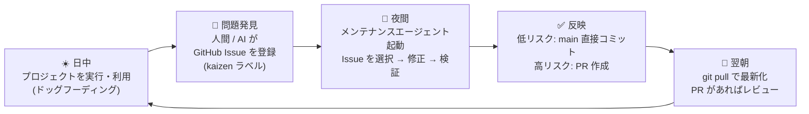
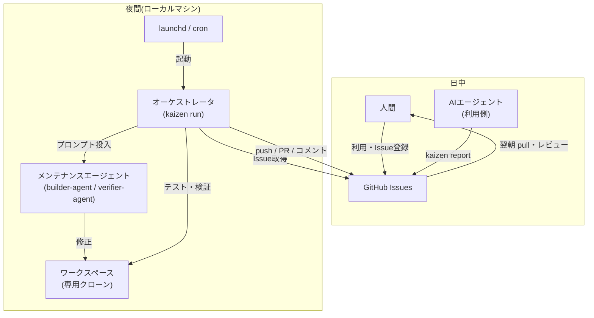

# 00. 概要

## 1. コンセプト

Kaizen Loop は、**改善したい対象プロジェクト(ターゲットプロジェクト)に仕込むセルフメンテナンスの仕組み**である。

開発者(人間)や AI エージェントが日中にターゲットプロジェクトを実際に使い(ドッグフーディング)、問題に気づいたら GitHub Issue として登録する。夜間、ローカルマシン上でメンテナンスエージェントが自動起動し、登録された Issue を読み取り、コードを修正・検証して反映する。翌朝、開発者が `git pull` すれば改善済みの最新状態でまたドッグフーディングを始められる。

このループを毎日回すことで、プロジェクトは「使われるたびに良くなる」状態を維持する。

## 2. デイリーループ

### タイムライン例(デフォルト設定)

| 時刻 | アクター | アクション |
|---|---|---|
| 日中随時 | 人間 / AI エージェント | ターゲットプロジェクトを利用。問題があれば `kaizen report` または `gh issue create` で Issue 登録 |
| 02:00 | launchd / cron | `kaizen run` を起動 |
| 02:00–06:00 | メンテナンスエージェント | Issue を優先度順に最大 N 件処理。修正 → テスト → 直接コミット or PR 作成。各 Issue に結果をコメント |
| 朝 | 人間 | `kaizen status` で夜間の結果を確認。`git pull`。PR があればレビュー & マージ |

## 3. ゴール / 非ゴール

### ゴール

- **G1**: 人間の介在なしに「Issue 登録 → 修正反映」のループが毎晩回ること
- **G2**: 翌朝のターゲットプロジェクトが、前日に登録された低リスクの問題については修正済みであること
- **G3**: 高リスクな変更は人間のレビューを経ること(PR)。安全性と自動化のバランスをラベルと機械的ルールで制御できること
- **G4**: 複数のターゲットプロジェクトに同じ仕組みを `kaizen init` 一発で導入できること
- **G5**: builder-agent へ渡す希望バックエンド(Claude / Codex)を設定・ラベルで切り替えられること
- **G6**: 失敗しても安全であること — 開発者の作業ツリーを壊さない、暴走しない、止められる

### 非ゴール

- クラウド常駐サービスではない(ローカルマシンのスケジューラで動く。マシンが起動していることが前提)
- 大規模な機能開発の自動化ではない(対象は不具合修正・小〜中規模の改善。大きな変更は PR で人間に委ねる)
- GitHub 以外のホスティング(GitLab 等)は初期スコープ外
- CI/CD の代替ではない(既存のテスト・CI を「利用」するが、置き換えない)

## 4. 用語定義

| 用語 | 定義 |
|---|---|
| **ターゲットプロジェクト** | Kaizen Loop を導入し、改善対象となる Git リポジトリ(GitHub リモートを持つ) |
| **Kaizen Issue** | `kaizen` ラベルが付いた GitHub Issue。夜間メンテナンスの処理対象 |
| **メンテナンスエージェント** | 夜間に起動し Issue を修正する builder-agent と、機械的検証後にレビューする verifier-agent |
| **オーケストレータ** | `kaizen run` の本体。Issue 選択・ワークスペース管理・エージェント起動・検証・反映・報告を決定論的に制御するプログラム。AI ではない |
| **ワークスペース** | 夜間作業専用のクローン(`~/.kaizen/workspaces/<slug>/`)。開発者の作業ツリーとは完全に分離 |
| **リスク判定** | 修正の diff・対象ファイル・ラベルから「直接コミット可否」を機械的に決めるルール(→ [04-nightly-pipeline.md](./04-nightly-pipeline.md)) |
| **ナイトリーレポート** | 1 回の夜間実行の結果サマリ。ローカルログ + 各 Issue へのコメントとして出力 |
| **slug** | ターゲットプロジェクトの識別子。`<owner>-<repo>` 形式(例: `s-hiraoku-kaizen-loop`) |

## 5. 登場アクターと責務

- **人間**: 利用、Issue 登録、PR レビュー、エスカレーションされた Issue の対応、ループの有効/無効の管理
- **利用側 AI エージェント**: 利用中に気づいた問題の Issue 登録(`kaizen report` を使う。書式は [05-issue-conventions.md](./05-issue-conventions.md))
- **オーケストレータ**: ループ全体の制御。**判断が必要な箇所はすべて機械的ルール**(リスク判定、リトライ上限、タイムアウト)で行い、再現性と安全性を担保する
- **メンテナンスエージェント**: 与えられた 1 Issue の修正のみに専念。反映方法(コミット/PR)の判断はしない(オーケストレータの責務)

## 6. 成功の計測(メトリクス)

ループが機能しているかを測るため、オーケストレータは実行ごとに以下を記録する(`summary.json`、→ [03-config-spec.md](./03-config-spec.md)):

- 処理した Issue 数 / 修正成功数 / 直接コミット数 / PR 数 / 失敗数
- Issue 登録から修正反映までのリードタイム
- エージェント実行時間・リトライ回数
- 直接コミット後に revert された数(自動修正の品質指標。revert 検知は Phase 3 → [08-roadmap.md](./08-roadmap.md))

`kaizen status --metrics` で累積値を確認できる。
