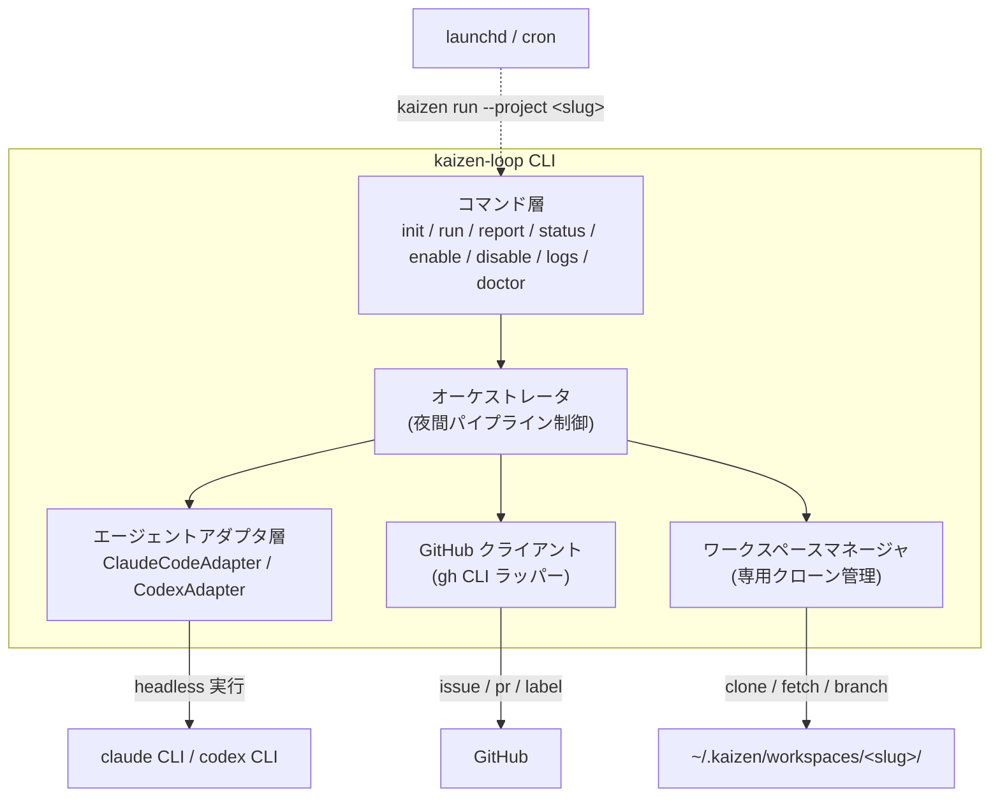

# 01. アーキテクチャ

## 1. 全体構成

Kaizen Loop は単一の Node.js (TypeScript) 製 CLI パッケージ `kaizen-loop` として配布される。実体は以下の 5 コンポーネントからなる。



### 設計原則

1. **オーケストレータは決定論的に**: Issue 選択、リスク判定、リトライ、反映方法の決定はすべてコード(機械的ルール)で行う。AI に委ねるのは「コードを修正する」行為のみ。これにより夜間の無人実行でも挙動が予測可能になる。
2. **外部ツールに委譲**: GitHub 操作は `gh` CLI、AI 実行は `claude` / `codex` CLI に委譲する。認証は各 CLI の既存セッションを利用し、Kaizen Loop 自体はトークンを保持しない。
3. **作業の分離**: 夜間作業は開発者の作業ツリーでは絶対に行わない(→ §3)。
4. **状態の分離**: リポジトリにコミットする設定(チームで共有するポリシー)と、マシンローカルの状態(スケジュール、ログ、ワークスペース)を分ける(→ §4)。

## 2. コンポーネント責務

### 2.1 コマンド層

CLI のエントリポイント。各コマンドの仕様は [02-cli-spec.md](./02-cli-spec.md)。

### 2.2 オーケストレータ

`kaizen run` の本体。夜間パイプライン([04-nightly-pipeline.md](./04-nightly-pipeline.md))を制御する。責務:

- プリフライトチェック(認証、CLI 存在、ロック取得)
- Kaizen Issue の取得・選択(優先度ソート、上限件数)
- ワークスペースの最新化、Issue ごとの作業ブランチ作成
- エージェントアダプタへの修正依頼(プロンプト構築・タイムアウト管理)
- 検証コマンド(テスト・lint・ビルド)の実行とリトライ制御
- リスク判定 → 直接コミット or PR 作成
- Issue へのコメント・ラベル更新・クローズ
- ナイトリーレポート(ローカル `summary.json` + ログ)の出力

### 2.3 エージェントアダプタ層

`claude` / `codex` CLI のヘッドレス実行を共通インターフェースで抽象化する。詳細は [06-agents.md](./06-agents.md)。

```typescript
interface AgentAdapter {
  readonly name: 'claude' | 'codex';
  /** CLI が利用可能か(インストール・認証済みか) */
  isAvailable(): Promise<boolean>;
  /** ワークスペース内でプロンプトを実行し、構造化結果を返す */
  run(req: AgentRequest): Promise<AgentResult>;
}

interface AgentRequest {
  workspaceDir: string;     // 実行ディレクトリ(専用クローン)
  prompt: string;           // 06-agents.md のプロンプト契約に従う
  timeoutMs: number;        // 超過時はプロセスを kill
  model?: string;           // アダプタ固有のモデル指定(任意)
}

interface AgentResult {
  status: 'fixed' | 'partial' | 'blocked' | 'error' | 'timeout';
  summary: string;          // エージェント自身による修正サマリ
  raw: string;              // 生ログ(デバッグ・Issue コメント用に保存)
  durationMs: number;
}
```

エージェントの選択順序: **Issue のラベル指定(`kaizen:agent:claude` / `kaizen:agent:codex`) > 設定ファイルの `agent.default` > 利用可能な方へのフォールバック**。

### 2.4 GitHub クライアント

`gh` CLI のラッパー。Issue 一覧取得(`gh issue list --json`)、コメント、ラベル操作、PR 作成、push を担う。API レート制限・一時的なネットワークエラーには指数バックオフで最大 3 回リトライする。

### 2.5 ワークスペースマネージャ

専用クローンのライフサイクル管理(→ §3)。

## 3. ワークスペースモデル(重要)

**夜間エージェントは開発者の作業ツリーでは動かさない。** 理由:

- 開発者の未コミット変更・stash・実行中の dev サーバを壊すリスクがある
- 夜間実行の前提状態(クリーンな main)を常に保証したい
- エージェントに `--dangerously-skip-permissions` 相当の自動承認モードを使うため、影響範囲を物理的に隔離したい

そのため、`kaizen init` 時に **専用クローン** を作成する:

```
~/.kaizen/
├── registry.json                  # 登録済みプロジェクト一覧(ローカル状態)
├── workspaces/
│   └── <slug>/                    # 夜間作業専用クローン(origin = 同じ GitHub リポジトリ)
└── projects/
    └── <slug>/
        ├── run.lock               # 多重起動防止ロック
        └── runs/
            └── <YYYY-MM-DDTHH-mm-ss>/
                ├── run.log        # オーケストレータのログ
                ├── summary.json   # 実行サマリ(メトリクス)
                └── issue-<N>/
                    ├── agent.log  # エージェント生ログ
                    └── verify.log # テスト・lint の出力
```

### ワークスペースの不変条件

- 毎 Issue の処理開始前に `git fetch origin && git checkout main && git reset --hard origin/main && git clean -fdx` で**完全に origin と同期**させる(夜間に人間が push していても追従する)
- 作業ブランチは `kaizen/issue-<番号>-<slug化したタイトル>` 形式
- 依存インストール(`npm ci` 等)は設定の `commands.setup` で定義し、reset 後に毎回実行する
- ワークスペースが壊れた場合(fetch 失敗が続く等)は削除して再クローンする(`kaizen doctor --repair`)

> **git worktree ではなく独立クローンを選ぶ理由**: worktree は開発者リポジトリと refs・index を共有するため、開発者側の操作(branch 削除、gc、rebase 中の状態)と干渉しうる。独立クローンはディスクを余分に使うが、隔離が完全で実装も単純。

## 4. 状態の置き場所

| 種別 | 場所 | コミット | 内容 |
|---|---|---|---|
| プロジェクト設定(ポリシー) | `<repo>/.kaizen/config.yml` | **する** | エージェント選択、検証コマンド、リスク判定ルール、上限値。チームで共有 |
| Issue テンプレート | `<repo>/.github/ISSUE_TEMPLATE/kaizen.yml` | **する** | Kaizen Issue の入力フォーム |
| ローカル登録簿 | `~/.kaizen/registry.json` | しない | どのプロジェクトがどのマシンでスケジュールされているか |
| 実行ログ・レポート | `~/.kaizen/projects/<slug>/runs/` | しない | 夜間実行の記録。リポジトリ履歴を汚さない |
| スケジューラ定義 | `~/Library/LaunchAgents/com.kaizen-loop.<slug>.plist`(macOS)<br/>crontab エントリ(Linux) | しない | 起動時刻 |

> ナイトリーレポートをリポジトリにコミットしない理由: 毎晩の機械的コミットで履歴が汚れるため。実行結果は「各 Issue へのコメント」として GitHub 上に残るので、チームからの可視性は保たれる。

## 5. スケジューラ

| OS | 機構 | 特性 |
|---|---|---|
| macOS | launchd (LaunchAgent, `StartCalendarInterval`) | **スリープ中に時刻を過ぎた場合、次回起床時に実行される**(取りこぼしに強い)。`kaizen enable` で plist を生成・ロード |
| Linux | cron | スリープ中の実行は取りこぼす。常時稼働マシン向け |

スケジューラが実行するのは固定で以下のコマンド:

```sh
kaizen run --project <slug> --scheduled
```

`--scheduled` フラグは「無人実行モード」を示し、対話プロンプトを一切出さず、失敗時は終了コードとログ・通知([02-cli-spec.md](./02-cli-spec.md) §run)で報告する。

## 6. 複数プロジェクト対応

- `~/.kaizen/registry.json` に複数プロジェクトを登録できる
- スケジューラ定義はプロジェクトごとに 1 エントリ(起動時刻をずらして API・マシン負荷を分散することを推奨。`kaizen init` がデフォルトで 02:00 / 02:30 / 03:00… と空き時刻を自動提案する)
- 同一プロジェクトの多重実行は `run.lock` で防止(→ [07-safety.md](./07-safety.md))

## 7. 技術スタック

| 項目 | 選定 | 理由 |
|---|---|---|
| 言語 / ランタイム | TypeScript / Node.js ≥ 20 | `npx` 配布、エコシステム。ターゲットプロジェクトの言語は問わない |
| CLI フレームワーク | commander(または citty) | 軽量・実績 |
| GitHub 操作 | `gh` CLI 呼び出し | 認証の再利用、API ラッパー実装の回避 |
| Git 操作 | `git` CLI 呼び出し(simple-git は使わない) | 挙動の透明性、ログにそのままコマンドを残せる |
| 設定 | YAML(`.kaizen/config.yml`) + JSON Schema によるバリデーション | 人間が編集しやすい。起動時に厳格に検証 |
| 配布 | npm パッケージ `kaizen-loop` | `npx kaizen-loop init` で導入 |

### 外部依存(ターゲットマシンの前提条件)

`kaizen doctor` がすべて検査する:

- `git` ≥ 2.30
- `gh` CLI(`gh auth status` が通ること)
- `claude` CLI または `codex` CLI の少なくとも一方(認証済み)
- Node.js ≥ 20
