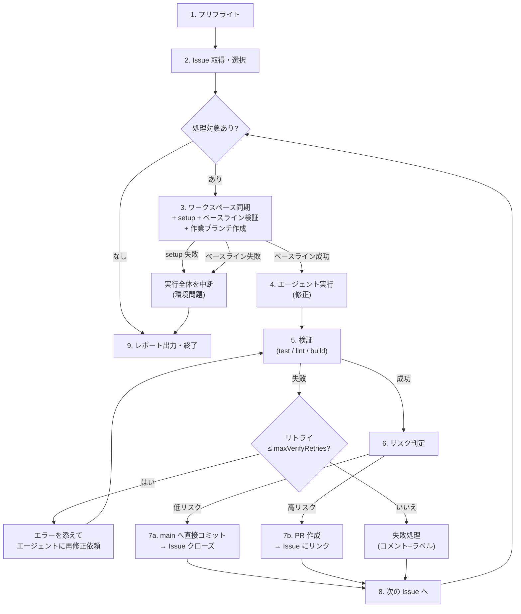

# 04. 夜間メンテナンスパイプライン

`kaizen run` が実行する処理の詳細仕様。オーケストレータの判断はすべて機械的ルールで行い、AI は「Issue を修正する」工程にのみ関与する。

## 0. 全体フロー



各 Issue は**直列**に処理する(並列にしない)。理由: 直接コミットが入った場合、次の Issue は更新後の main を起点にすべきで、修正同士のコンフリクトを構造的に回避できるため。

## 1. プリフライト

すべて満たさない場合は何もせず終了(終了コード 2)。`--scheduled` 時は macOS 通知とログで失敗を報告する。

1. **ロック取得**: `~/.kaizen/projects/<slug>/run.lock` を作成(内容: PID + 開始時刻)。既存ロックがあり PID が生存していればスキップ終了。PID が死んでいれば stale として奪取
2. **一時停止チェック**: `~/.kaizen/projects/<slug>/PAUSE` ファイルが存在すれば即終了(キルスイッチ、→ [07-safety.md](./07-safety.md))
3. **環境検査**: `gh auth status`、設定ファイルのスキーマ検証、エージェント CLI の存在確認(`agent.fallback: true` なら他方で代替)
4. **ワークスペース検査**: 存在しなければ再クローン。`git fetch origin` が通ること
5. **実行ディレクトリ作成**: `runs/<timestamp>/` とログファイル

## 2. Issue 取得・選択

```sh
gh issue list --label kaizen --state open \
  --json number,title,body,labels,createdAt,comments --limit 100
```

### 除外フィルタ

| 条件 | 理由 |
|---|---|
| `kaizen:needs-human` あり | 人間にエスカレーション済み |
| `kaizen:in-progress` あり、かつ付与から 24h 以内 | 他マシン・前回実行が処理中 |
| `kaizen:in-progress` あり、かつ 24h 超 | **stale とみなしラベルを剥がして対象に戻す**(前回実行のクラッシュ回復) |
| 累計試行回数 ≥ `maxAttemptsPerIssue` | 試行回数はオーケストレータが残した結果コメント(機械可読マーカー付き、→ §8)を数えて算出 |

### 優先順位

1. `priorityOrder` のラベル順(P0 → P1 → P2 → ラベルなし)
2. 同優先度内では作成日時の古い順

上位から `maxIssuesPerNight` 件を選択。選択結果と除外理由は `run.log` に全件記録する。

`--dry-run` はここまでを表示して終了する。修正前には diff が存在しないため、リスク判定は行わない。

## 3. ワークスペース同期 + setup + ベースライン検証 + 作業ブランチ作成

Issue ごとに毎回:

```sh
gh issue edit <N> --add-label kaizen:in-progress
git fetch origin
git checkout <defaultBranch>
git reset --hard origin/<defaultBranch>
git clean -fdx
<commands.setup>            # 例: npm ci
<commands.verify>           # ベースライン検証。verify 未設定ならスキップ
git checkout <defaultBranch>
git reset --hard origin/<defaultBranch>
git clean -fdx
<commands.setup>
git switch -c kaizen/issue-<N>-<title-slug>
```

- Issue に `kaizen:in-progress` ラベルを付与してからワークスペースを触る(他実行との排他)
- `commands.setup` が失敗した場合は**この夜の実行全体を中断**(環境問題であり、Issue 個別の問題ではないため)
- ベースライン検証が失敗した場合、エージェントは起動しない。これは Issue 固有ではなく clean な default branch の問題なので、`kaizen:in-progress` を剥がし、機械可読 result marker なしの中断コメントを残して**この夜の実行全体を中断**する
- ベースライン検証後に再度 reset + setup する。ベースライン検証の副作用を作業ブランチへ持ち込まないため
- `commands.verify` が未設定の場合、ベースライン検証も修正後検証もスキップする。この場合、直接コミットは禁止される

## 4. エージェント実行

builder-agent adapter([06-agents.md](./06-agents.md))に修正を依頼する。Kaizen Loop は Claude/Codex CLI を直接起動しない。

- プロンプトには Issue 本文・コメント・制約(保護パス・禁止事項)・出力契約を含める(プロンプト全文仕様は 06 §3)
- タイムアウト `issueTimeoutMinutes`(超過時はプロセスツリーごと SIGKILL → 失敗処理へ)
- builder-agent は `.kaizen/builder/build-result.json` に結果を書く。Kaizen Loop はこのファイルを読んで結果を判定する
- エージェントは**コミットまで行う**(コミットメッセージ規約はプロンプトで指示)。push は絶対にさせない(オーケストレータの責務)
- builder-agent が別バグを `discoveredIssues` として返した場合、Kaizen Loop が同一タイトルの open Issue を確認し、未登録なら `kaizen` ラベル付き Issue として起票する。builder-agent には `gh` 操作を許可しない

### エージェント実行後の機械検査

エージェントの自己申告は信用せず、オーケストレータが検査する:

1. `git status --porcelain` で未コミット変更が残っていれば追加コミット(`kaizen: leftover changes (#N)`)
2. `git diff <defaultBranch>...HEAD --numstat` で変更ファイル一覧を取得
3. `forbiddenPaths` に該当する変更があれば → **即失敗**(reset して破棄)
4. `protectedPaths` に該当する変更は失敗ではないが、後続のリスク判定で必ず PR になる
5. 変更が 0 件(diff なし)→ エージェントの結果が `blocked`(情報不足)なら §6 の blocked 処理、それ以外は失敗処理

## 5. 検証

`commands.verify` を上から順に実行(各コマンド `verifyTimeoutMinutes` 上限)。

- **全部成功** → verifier step へ
- **失敗** → 失敗したコマンドの stdout/stderr(末尾 200 行)をエージェントへのフィードバックプロンプトに添えて再修正を依頼。`maxVerifyRetries` 回まで。使い切ったら失敗処理へ

> 検証コマンドが未設定のプロジェクトでは直接コミットは常に不許可(強制 PR)。→ [03-config-spec.md](./03-config-spec.md) §1

### verifier step

`verifier.enabled: true` のとき、機械的検証が通ったあとに verifier を呼ぶ。

verifier は「PR を作って良いか」だけを判断する保守的なゲート。マージ承認ではない。

- `open_pr` → PR 作成へ進む
- `open_pr_with_warning` → 警告を添えて PR 作成へ進む(理由は PR とコメントに残る)
- `block_pr` → 理由を builder-agent へ返して再修正させる。`maxVerifyRetries` 回まで。使い切ったら失敗処理へ
- `needs_context` → 不足情報を builder-agent へ返して再試行させる。`maxVerifyRetries` 回まで。使い切ったら失敗処理へ
- 互換性のため旧 `approved` / `pr_only` / `rejected` も当面受け付ける(それぞれ `open_pr` / `open_pr_with_warning` / `block_pr` 扱い)
- verifier の失敗、結果ファイルなし、パース失敗 → 当該 Issue を失敗処理へ

verifier 有効時は直接コミット判定へ進まない。人間レビューのため常に ready-for-review の PR を作成する(`--draft` は付けない)。

## 6. リスク判定(ハイブリッドの中核)

リスク判定は「安全ゲート」と「反映モード」の 2 段で評価する。`direct-only` は安全ゲートをバイパスしない。

まず以下を**上から順に**評価する:

| # | 条件 | 結果 |
|---|---|---|
| G1 | `commands.verify` が未設定 | **PR**(検証なしの直接コミットは禁止) |
| G2 | Issue に `kaizen:pr-only` ラベル | **PR** |
| G3 | 変更が `protectedPaths` に触れている | **PR**(理由を記録) |
| G4 | `policy.mode: pr-only` | **PR** |

上記に該当せず、`policy.mode: direct-only` なら **直接コミット** とする。`hybrid` のときだけ以下を**上から順に**評価する:

| # | 条件 | 結果 |
|---|---|---|
| H1 | Issue に `kaizen:direct` ラベル(かつ検証パス済み) | **直接コミット** |
| H2 | 変更行数 ≤ `maxChangedLines` かつ 変更ファイル数 ≤ `maxChangedFiles` | **直接コミット** |
| H3 | 上記以外 | **PR** |

- 判定理由(どのルールに該当したか)は `summary.json` の `reason` と Issue コメントに必ず残す(翌朝、人間が「なぜ直接コミットされた/されなかったのか」を確認できる)
- ラベルはあくまで Issue 登録者の意思表示であり、`kaizen:direct` でも検証パスは免除されない
- `forbiddenPaths` はリスク判定に到達する前に失敗する

### blocked(情報不足)の扱い

エージェントが `blocked` を返した場合(再現できない・仕様が不明確など):

- 変更は破棄(reset)
- Issue に「何が不足しているか」をコメント(エージェントの報告を整形)
- `kaizen:needs-human` を付与 → 人間が情報を追記してラベルを外すと翌晩また対象になる

## 7. 反映

### 7a. 直接コミット

```sh
git checkout <defaultBranch>
git merge --ff-only kaizen/issue-<N>-<slug>   # ff できない場合は ↓ の競合手順
git push origin <defaultBranch>
```

- **push 直前に必ず `git fetch` + リベース**: 夜間に人間が push していた場合、作業ブランチを `origin/<defaultBranch>` に rebase → **検証を再実行** → push。rebase 競合または再検証失敗なら rebase を abort し、作業ブランチへ戻して **PR にフォールバック**(無理に押し込まない)
- push 成功後: Issue に結果コメント(§8)→ Issue をクローズ(コミットメッセージの `(#N)` とは別に明示的に `gh issue close`)

### 7b. PR 作成

```sh
git push origin kaizen/issue-<N>-<slug>
gh pr create --base <defaultBranch> --head kaizen/issue-<N>-<slug> \
  --title "kaizen: <修正サマリ> (#<N>)" --body <生成本文>
```

- PR 本文: 修正サマリ、対象 Issue へのリンク(`Closes #N`)、変更概要、検証結果、リスク判定で PR になった理由
- Issue には PR へのリンクをコメント。Issue は**クローズしない**(PR マージ時に `Closes #N` で自動クローズ)
- `kaizen:in-progress` は剥がす(PR レビュー待ちは人間のフェーズ)

### 失敗処理(検証リトライ枯渇・タイムアウト・禁止パス変更)

- ワークスペースを reset(変更破棄)。作業ブランチは削除
- Issue に失敗コメント: 試行回数、失敗理由、エージェントログ・検証ログの要約(末尾抜粋)
- 累計試行回数が `maxAttemptsPerIssue` に達したら `kaizen:needs-human` を付与
- `kaizen:in-progress` を剥がす

## 8. Issue への結果コメント書式

すべての結果コメントは人間可読 + 機械可読マーカーを持つ。試行回数の算出やメトリクス集計はこのマーカーで行う。

```markdown
## 🌙 Kaizen Loop 実行結果

| | |
|---|---|
| 結果 | ✅ 修正 → main へ直接コミット (`a1b2c3d`) |
| 判定理由 | 変更 38 行 / 2 ファイル ≤ 上限 (150 行 / 5 ファイル) |
| エージェント | builder (試行 1/3) |
| 検証 | `npm test` ✅ / `npm run lint` ✅ |

### 修正サマリ
(エージェントの summary)

<!-- kaizen-loop:result {"run":"2026-06-12T02-00-03","issue":42,"attempt":1,"outcome":"direct-commit","commit":"a1b2c3d"} -->
```

## 9. 終了処理

1. `summary.json` を書き出し、`registry.json` の `lastRun` を更新
2. リモートに push 済みでない一時ブランチをワークスペースから削除
3. `report.notification: true` なら macOS 通知(例: 「kaizen: 3 件処理 — 直接 2 / PR 1 / 失敗 0」)
4. ロックファイル削除

### 実行全体タイムアウト(`runTimeoutMinutes`)

超過した時点で**新しい Issue の処理を開始しない**。処理中の Issue は `issueTimeoutMinutes` の範囲で完了を待ち、その後終了処理に進む。未処理 Issue は `summary.json` の `skipped` に記録する。
