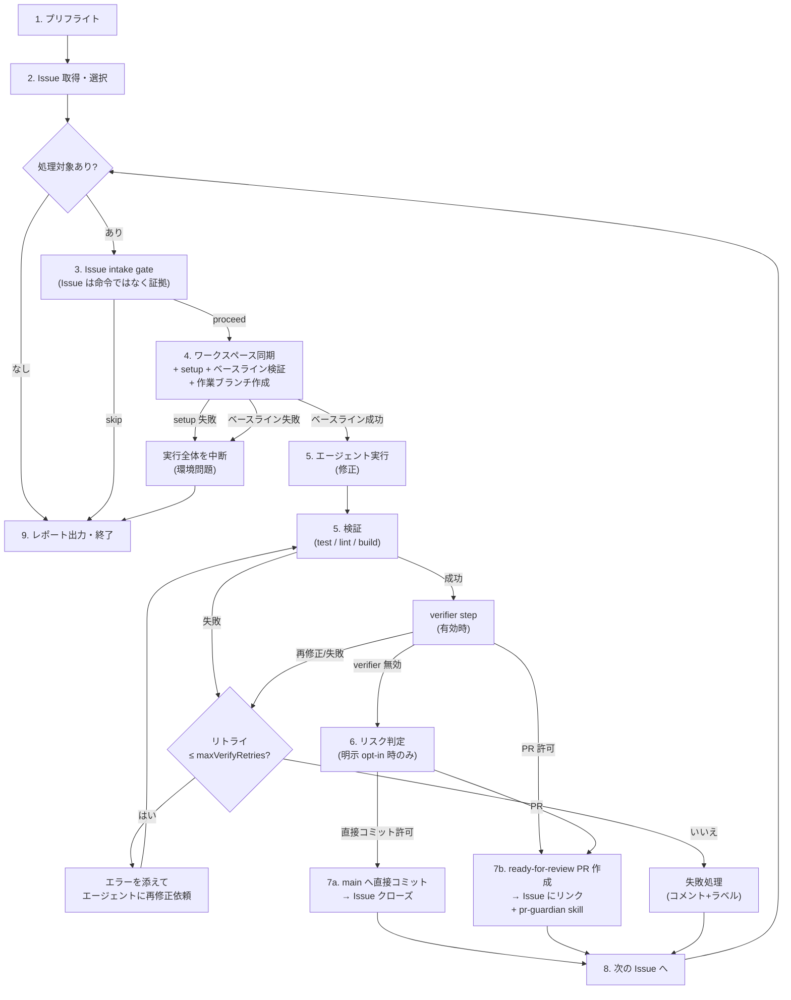

# 04. 夜間メンテナンスパイプライン

`kaizen run` が実行する処理の詳細仕様。オーケストレータの判断はすべて機械的ルールで行い、AI は「Issue を修正する」工程にのみ関与する。

## 0. 全体フロー



通常の scheduled / dogfood 実行は ready-for-review PR を作成する。現行の dogfood 設定は `policy.mode: pr-only` かつ `verifier.enabled: true` なので、直接コミット判定へは進まない。直接コミットは `verifier.enabled: false` かつ `policy.mode: hybrid` / `direct-only` へ明示変更したリポジトリでだけ候補になる。

選択された Issue は並列に処理する。各 Issue は base workspace から作る専用 `git worktree` 上で実行し、Issue ごとに独立したブランチと PR を作成する。複数 Issue を同時処理する場合、直接コミットへは進めず PR に寄せる。

## 1. プリフライト

すべて満たさない場合は何もせず終了(終了コード 2)。`--scheduled` 時は macOS 通知とログで失敗を報告する。

1. **ロック取得**: `~/.kaizen/projects/<slug>/run.lock` を作成(内容: PID + 開始時刻)。既存ロックがあり PID が生存していればスキップ終了。PID が死んでいれば stale として奪取
2. **一時停止チェック**: `~/.kaizen/projects/<slug>/PAUSE` ファイルが存在すれば即終了(キルスイッチ、→ [07-safety.md](./07-safety.md))
3. **環境検査**: `gh auth status`、設定ファイルのスキーマ検証、エージェント CLI の存在確認(`agent.fallback: true` なら他方で代替)
4. **ワークスペース検査**: 存在しなければ再クローン。`git fetch origin` が通ること
5. **実行ディレクトリ作成**: `runs/<timestamp>/` とログファイル

## 2. Issue 取得・選択

```sh
gh issue list --label kaizen --state open \
  --json number,title,body,labels,createdAt,comments --limit 100
```

取得後、`issues.selection` を適用する。`auto` は既存互換で `kaizen` ラベル付き Issue を候補にする。`opt-in` は `kaizen:ready` などの `includeLabel` がある Issue だけを候補にする。`manual-only` は scheduled / backlog 実行では自動選択しない。

### 除外フィルタ

| 条件 | 理由 |
|---|---|
| `kaizen:needs-human` あり | 未回答の具体的な human request がある |
| `kaizen:blocked` / `kaizen:upstream-first` / `kaizen:not-actionable` / `kaizen:attempts-exhausted` あり | terminal disposition。対応後に該当ラベルを外すまで再実行しない |
| `kaizen:retryable` あり | 除外しない。次の eligible scheduled run で再試行する |
| `kaizen:in-progress` あり、かつ付与から 24h 以内 | 他マシン・前回実行が処理中 |
| `kaizen:in-progress` あり、かつ 24h 超 | **stale とみなしラベルを剥がして対象に戻す**(前回実行のクラッシュ回復) |
| `kaizen-loop:progress` / `kaizen-loop:result` コメントに、現在 open な PR を指す pending PR marker あり | 既に PR 作成済み。review/merge 待ちの Issue を再処理しない。PR が close/merge 済みなら再処理対象に戻る |

`--scheduled` の自動実行では、選択後に `gh pr list --state open` で repo の open PR 数を確認する。open PR 数が `run.maxOpenPullRequests` 以上なら、新しい Issue は処理せず `open pull request limit reached` としてスキップする。これは未レビュー PR が溜まりすぎて競合やレビュー滞留を増やさないための backpressure である。明示実行(`kaizen fix` / `--issue`)はこの backpressure の対象外。

固定ブランチを再利用する deterministic sync PR は、通常の Issue 実装 PR と別扱いにする。`codex/daily-dogfood-sync`、`codex/sync-kaizen-dogfood`、`codex/sync-kaizen-shared-skills` の open PR は `run.maxOpenPullRequests` のカウント対象に含めない。

さらに `--scheduled` の自動実行では、owner 全体の open 生成 PR 数を確認する。bot が作成した open PR が `safety.wipLimit`(デフォルト 5) 以上なら、新しい Issue は処理せず `generated pull request WIP limit reached` として run summary に記録する。これは scout / monitor などの生成側が、人間の review 帯域を超えて PR を積み上げ続けることを防ぐための組織横断 backpressure である。

### 優先順位

1. `priorityOrder` のラベル順(P0 → P1 → P2 → ラベルなし)
2. 同優先度内では作成日時の古い順

上位から `maxIssuesPerNight` 件を選択。選択結果と除外理由は `run.log` に全件記録する。

`--dry-run` はここまでを表示して終了する。修正前には diff が存在しないため、リスク判定は行わない。

## 3. Issue intake gate

選択後、worktree 作成や builder-agent 実行の前に intake gate を通す。Issue は実装命令ではなく改善候補の証拠として扱う。

gate は構造化 decision を出し、`proceed` 以外は Issue コメントと run summary の skipped reason に記録する。decision は exhaustive mapper で primary disposition に変換し、catch-all で `kaizen:needs-human` にしない。

| decision | 意味 |
|---|---|
| `proceed` | scoped improvement として builder-agent に渡す |
| `needs_human` | 別リポジトリでの live 操作など、現在の builder workspace / execution authorization の外にある作業 |
| `needs_context` | 情報不足。Issue に不足情報をコメントする |
| `upstream_first` | source-of-truth / upstream を先に直すべき |
| `not_improvement` | safety / verification / review guardrail を弱める可能性が高い |
| `already_resolved` | 既存 PR / コメント上の解決済み work がある |

`needs_human` / `needs_context` だけが具体的な human request を作り `kaizen:needs-human` を付ける。人間が回答または承認してラベルを外すと、timeline と versioned request marker から acknowledgement を記録し、同一 request の gate を通過する。`upstream_first` は `kaizen:upstream-first`、`not_improvement` は `kaizen:not-actionable` とする。

builder-agent との rollout は **新しい kaizen-loop を先、新しい builder-agent を後**の順にする。新 kaizen-loop は `humanRequest` のない旧 builder payload を `kaizen:blocked` として安全に処理できる。逆順では旧 kaizen-loop の strict payload parser が新フィールドを拒否するため、同時または builder-first rollout は行わない。

## 4. ベースライン検証 + Issue 別 worktree 作成

run 開始時に base workspace を 1 回だけ同期し、setup とベースライン検証を実行する:

```sh
git fetch origin
git checkout <defaultBranch>
git reset --hard origin/<defaultBranch>
git clean -fdx
<commands.setup>            # 例: npm ci
<commands.verify>           # ベースライン検証。verify 未設定ならスキップ
git checkout <defaultBranch>
git reset --hard origin/<defaultBranch>
git clean -fdx
```

ベースライン検証が通ったら、選択された Issue ごとに専用 worktree を作る:

```sh
gh issue edit <N> --add-label kaizen:in-progress
git worktree add -B kaizen/issue-<N>-<title-slug> \
  <workspacePath>-worktrees/<runId>/issue-<N> \
  origin/<defaultBranch>
<commands.setup>
```

- Issue に `kaizen:in-progress` ラベルを付与してから Issue 用 worktree 上で実装を開始する
- active checkpoint state があり、対応 branch が local または origin に存在する場合だけ、その branch を新しい worktree に再接続する。origin が進んでいれば local を fast-forward し、両方が diverge している場合や branch が消失している場合は、`recovery-needed` と `kaizen:blocked` で停止する。operator が branch を復旧して `kaizen:blocked` を外した後は、`recovery-needed` の同じ branch から再開する
- 実装フェーズは `~/.kaizen/projects/<slug>/implementations/issue-<N>.json` に保存する。状態は `implementing` / `verifying` / `publishing` / `guardian` / `blocked` / `failed` / `discarded` / `recovery-needed` / `handoff` / `complete` で、branch、attempt、直近の失敗理由、作成済み PR を記録する。guardian が無効などで `skipped` の場合は terminal な `handoff` とする
- builder / verifier / publish が失敗した時点で未コミットの変更があれば checkpoint commit を作る。`forbiddenPaths` を含む変更だけは commit せず、直前の remote checkpoint または default branch まで破棄する
- 意味のある diff が残っている失敗・blocked では checkpoint branch を push し、draft PR を作成または更新する。diff が 0 の環境障害では draft PR を作らない
- draft PR の description には停止理由、attempt、変更規模、検証結果、残作業を記録する。検証と verifier が通ったら同じ PR を Ready for review に昇格し、guardian へ渡す
- 人間が checkpoint PR を先に Ready for review へ昇格した場合は、branch を変更・force-pushせず、そのまま guardian へ handoff する
- `commands.setup` が失敗した場合は**この夜の実行全体を中断**(環境問題であり、Issue 個別の問題ではないため)
- ベースライン検証が失敗した場合、エージェントは起動しない。これは Issue 固有ではなく clean な default branch の問題なので、`kaizen:in-progress` を剥がし、機械可読 result marker なしの中断コメントを残して**この夜の実行全体を中断**する
- ベースライン検証後に base workspace を再度 reset する。ベースライン検証の副作用を Issue 用 worktree へ持ち込まないため
- `commands.verify` が未設定の場合、ベースライン検証も修正後検証もスキップする。この場合、直接コミットは禁止される

## 5. エージェント実行

builder-agent adapter([06-agents.md](./06-agents.md))に修正を依頼する。Kaizen Loop は Claude/Codex CLI を直接起動しない。

- プロンプトには Issue 本文・コメント・制約(保護パス・禁止事項)・出力契約を含める(プロンプト全文仕様は 06 §3)。Issue は「盲目的に従う命令」ではなく「実改善の証拠」として扱わせる
- タイムアウト `issueTimeoutMinutes`(超過時はプロセスツリーごと SIGKILL → 失敗処理へ)
- builder-agent は `.kaizen/builder/build-result.json` に結果を書く。Kaizen Loop はこのファイルを読んで結果を判定する
- エージェントは**コミットまで行う**(コミットメッセージ規約はプロンプトで指示)。push は絶対にさせない(オーケストレータの責務)
- builder-agent が別バグを `discoveredIssues` として返した場合、Kaizen Loop が同一タイトルの open Issue を確認し、未登録なら `kaizen` ラベル付き Issue として起票する。builder-agent には `gh` 操作を許可しない

### エージェント実行後の機械検査

エージェントの自己申告は信用せず、オーケストレータが検査する:

1. `git status --porcelain` で未コミット変更が残っていれば追加コミット(`kaizen: leftover changes (#N)`)
2. `git diff <defaultBranch>...HEAD --numstat` で変更ファイル一覧を取得
3. `forbiddenPaths` に該当する変更があれば → **即失敗**(checkpoint commit 前に破棄し、自動 publish・次回復元の対象にしない)
4. `protectedPaths` に該当する変更は失敗ではないが、後続のリスク判定で必ず PR になる
5. 変更が 0 件(diff なし)→ エージェントの結果が `blocked`(情報不足)なら §6 の blocked 処理、それ以外は失敗処理

## 5. 検証

`commands.verify` を上から順に実行(各コマンド `verifyTimeoutMinutes` 上限)。

- **全部成功** → verifier step へ
- **失敗** → 失敗したコマンドの stdout/stderr(末尾 200 行)をエージェントへのフィードバックプロンプトに添えて再修正を依頼。`maxVerifyRetries` 回まで。使い切ったら失敗処理へ

> 検証コマンドが未設定のプロジェクトでは直接コミットは常に不許可(強制 PR)。→ [03-config-spec.md](./03-config-spec.md) §1

### verifier step

`verifier.enabled: true` のとき、機械的検証が通ったあとに verifier を呼ぶ。

verifier は「PR を作って良いか」だけを判断する保守的なゲート。マージ承認ではない。

- `open_pr` → PR 作成へ進む
- `open_pr_with_warning` → 警告を添えて PR 作成へ進む(理由は PR とコメントに残る)
- `block_pr` → 理由を builder-agent へ返して再修正させる。`maxVerifyRetries` 回まで。使い切ったら失敗処理へ
- `needs_context` → 不足情報を builder-agent へ返して再試行させる。`maxVerifyRetries` 回まで。使い切ったら失敗処理へ
- 互換性のため旧 `approved` / `pr_only` / `rejected` も当面受け付ける(それぞれ `open_pr` / `open_pr_with_warning` / `block_pr` 扱い)
- verifier の失敗、結果ファイルなし、パース失敗 → 当該 Issue を失敗処理へ

verifier 有効時は直接コミット判定へ進まない。人間レビューのため常に ready-for-review の PR を作成する(`--draft` は付けない)。標準の dogfood 経路はこの動作を使う。

## 6. リスク判定(明示 opt-in の直接コミット)

この節は `verifier.enabled: false` の場合だけ到達する。`verifier.enabled: true` の通常運用では、検証後に ready-for-review PR を作成する。

リスク判定は「安全ゲート」と「反映モード」の 2 段で評価する。`direct-only` は安全ゲートをバイパスしない。

まず以下を**上から順に**評価する:

| # | 条件 | 結果 |
|---|---|---|
| G1 | `commands.verify` が未設定 | **PR**(検証なしの直接コミットは禁止) |
| G2 | Issue に `kaizen:pr-only` ラベル | **PR** |
| G3 | 変更が `protectedPaths` に触れている | **PR**(理由を記録) |
| G4 | `policy.mode: pr-only` | **PR** |

上記に該当せず、`policy.mode: direct-only` なら **直接コミット** とする。`hybrid` のときだけ以下を**上から順に**評価する:

| # | 条件 | 結果 |
|---|---|---|
| H1 | Issue に `kaizen:direct` ラベル(かつ検証パス済み) | **直接コミット** |
| H2 | 変更行数 ≤ `maxChangedLines` かつ 変更ファイル数 ≤ `maxChangedFiles` | **直接コミット** |
| H3 | 上記以外 | **PR** |

- 判定理由(どのルールに該当したか)は `summary.json` の `reason` と Issue コメントに必ず残す(翌朝、人間が「なぜ PR になった/明示 opt-in の直接コミットになったのか」を確認できる)
- ラベルはあくまで Issue 登録者の意思表示であり、`kaizen:direct` でも検証パスは免除されない
- `forbiddenPaths` はリスク判定に到達する前に失敗する

### blocked の扱い

エージェントが `blocked` を返した場合(再現できない・仕様が不明確など):

- 途中変更は Issue branch に checkpoint commit として保存する。ただし `forbiddenPaths` を含む変更は保存せず破棄する
- 途中変更がある場合は draft PR に公開し、Issue の結果コメントからリンクする
- Issue に停止理由をコメント(エージェントの報告を整形)
- builder payload に schema-valid な `humanRequest` がある場合だけ `kaizen:needs-human` を付ける
- `humanRequest` がなければ `kaizen:blocked` とする。blocked reason の自由文から human request を推測しない

結果コメントが `retryableExternal: true` の blocked、または旧形式コメントでも `command_missing`、`auth_failed`、timeout、rate limit などの既知の外部障害証拠を含む blocked は `kaizen:retryable` とする。自動再試行を行い、`maxAttemptsPerIssue` 回の連続 retryable block で `kaizen:attempts-exhausted` へ遷移する。

schema-valid な `humanRequest` と retryable 外部障害の証拠が同時にある場合は `humanRequest` が優先され、primary disposition は `kaizen:needs-human` になる。人間が同一 request を acknowledgement するまでは retryable 回数に数えない。acknowledgement 後の再実行で新たに `retryableExternal` のみが返った時点から retry budget を消費する。

## 7. 反映

### 7a. 直接コミット(明示 opt-in / verifier 無効時のみ)

通常の scheduled / dogfood 実行では使わない。`verifier.enabled: false` かつ `policy.mode: hybrid` / `direct-only` の明示 opt-in 設定で、§6 の安全条件を満たした場合だけ実行する。

```sh
git checkout <defaultBranch>
git merge --ff-only kaizen/issue-<N>-<slug>   # ff できない場合は ↓ の競合手順
git push origin <defaultBranch>
```

- **push 直前に必ず `git fetch` + リベース**: 夜間に人間が push していた場合、作業ブランチを `origin/<defaultBranch>` に rebase → **検証を再実行** → push。rebase 競合または再検証失敗なら rebase を abort し、作業ブランチへ戻して **PR にフォールバック**(無理に押し込まない)
- push 成功後: Issue に結果コメント(§8)→ Issue をクローズ(コミットメッセージの `(#N)` とは別に明示的に `gh issue close`)

### 7b. PR 作成

```sh
git push origin kaizen/issue-<N>-<slug>
gh pr create --base <defaultBranch> --head kaizen/issue-<N>-<slug> \
  --title "kaizen: <修正サマリ> (#<N>)" --body <生成本文>
codex exec --cd <workspace> "... skills/pr-guardian/SKILL.md ..."
```

- PR 本文は「5 分でマージ判断できる証拠パッケージ」として、以下 6 セクションを必須で含める(`buildPullRequestBody`、`test/integration/dry-run.test.ts` の `includes all six evidence-package sections in generated PR bodies` で欠落を検出する):
  1. `## 元Issue` — 対象 Issue 番号・タイトルと本文の要約(`Closes #N` はタイトル直上に別途出力)
  2. `## Builder task understanding`(+ 存在すれば `## Builder notes`) — builder-agent の自己申告 summary / notes をそのまま転記する。builder-agent が構造化された task-understanding フィールドを別途契約化した場合はそれに差し替える
  3. `## 変更ファイル` — `git diff --name-only` 由来の変更ファイル一覧、各ファイルに builder が報告した変更理由、changed files/lines 件数
  4. `## Verification` — 設定済み検証コマンドの成功/失敗チェックリスト。`commands.verify` が未設定の場合は「スキップ: リポジトリに検証コマンドが設定されていません」と明示する
  5. `## Verifier verdict` — verifier 有効時の `verifier: open_pr` / `verifier: open_pr_with_warning` とその根拠、`evidence: executed` / `evidence: reported (未実行の可能性あり)` を表示する。verifier が返した構造化 `must_fix` / `should_fix`、0–100 の `confidence`、`low` / `medium` / `high` の `risk` も存在する場合は保持し、PR と Issue の evidence に表示する。旧 verifier の notes-only payload は引き続き表示する。verifier 無効時は `verifier: not run` と明示する
  6. `## 残存リスク / レビュー観点` — リスク判定または並列実行で PR になった理由をレビュアー向けの着眼点として表示する
- さらに `## Evidence strength` セクションで、builder-agent の自己申告は `reported`、Kaizen Loop が実行した verify / verifier は `executed`、未設定の verify / verifier は `unverified`、git diff 由来の変更ファイル・行数は `static` として証拠強度を要約する
- PR 作成直後、Kaizen Loop は Issue に PR リンクと「monitoring CI and review feedback」をコメントする
- `guardian.mode: sync` では、Kaizen Loop は vendored `skills/pr-guardian/SKILL.md` を設定済みの `guardian.command` で実行する。CI 監視、`gh run watch`、未解決の actionable review feedback 対応、mergeable 判定は `pr-guardian` skill の責務。TypeScript 側は各 pass 後に未解決・非 outdated の review thread を確認し、残っていれば `guardian.maxAttempts` まで再実行する。approval 不足は branch protection が明示要求している場合だけ blocker として扱う
- `guardian.mode: async` では、PR 作成後に `~/.kaizen/projects/<slug>/guardian/jobs/` へ job を保存して foreground run を終了する。job は repo、PR 番号、URL、branch、base branch、head SHA、retry budget、attempt count、status、last checked time、last blocker、late-review reactivation count を持つ。`kaizen guardian watch` は pending/blocked job に加えて successful open job を再観測し、同一 head に新しい blocker が現れた場合だけ再活性化する。既知marker付きの生成sync PRも採用し、利用者のcheckoutを変更しない隔離worktreeで処理する。`kaizen guardian run <pr>` は head SHA が変わっていれば新しい job として実行する
- guardian 完了後、Issue には最終結果コメントを残す。Issue は**クローズしない**(PR マージ時に `Closes #N` で自動クローズ)
- `kaizen:in-progress` は剥がす(PR レビュー待ちは人間のフェーズ)
- checkpoint draft PR から再開した場合は、新規 PR を増やさず同じ PR の description と head を更新し、検証成功後に Ready for review へ昇格する

### 失敗処理(検証リトライ枯渇・タイムアウト・禁止パス変更)

- Issue 用 worktree を削除する。作業ブランチは再実行時の復旧・調査用にローカルへ残す
- Issue に失敗コメント: 試行回数、失敗理由、エージェントログ・検証ログの要約(末尾抜粋)
- 累計試行回数が `maxAttemptsPerIssue` に達したら `kaizen:attempts-exhausted` を付与
- `kaizen:in-progress` を剥がす

## 8. Issue への結果コメント書式

すべての結果コメントは人間可読 + 機械可読マーカーを持つ。試行回数の算出やメトリクス集計はこのマーカーで行う。

```markdown
## 🌙 Kaizen Loop 実行結果

| | |
|---|---|
| 結果 | ✅ 修正 → ready-for-review PR 作成 (`https://github.com/org/repo/pull/123`) |
| 判定理由 | verifier: open_pr |
| エージェント | builder (試行 1/3) |
| 検証 | `npm test` ✅ / `npm run lint` ✅ |

### 修正サマリ
(エージェントの summary)

<!-- kaizen-loop:result {"run":"2026-06-12T02-00-03","issue":42,"attempt":1,"outcome":"pr-created","pr":"https://github.com/org/repo/pull/123"} -->
```

## 9. 終了処理

1. `summary.json` と `projects/<slug>/last-run.json` を書き出す。run telemetry は topology を持つ `registry.json` を更新しない
2. リモートに push 済みでない一時ブランチをワークスペースから削除
3. `report.notification: true` なら macOS 通知(例: 「kaizen: 3 件処理 — PR 3 / 直接 0 / 失敗 0」)
4. ロックファイル削除

### 実行全体タイムアウト(`runTimeoutMinutes`)

超過した時点で**新しい Issue の処理を開始しない**。処理中の Issue は `issueTimeoutMinutes` の範囲で完了を待ち、その後終了処理に進む。未処理 Issue は `summary.json` の `skipped` に記録する。
