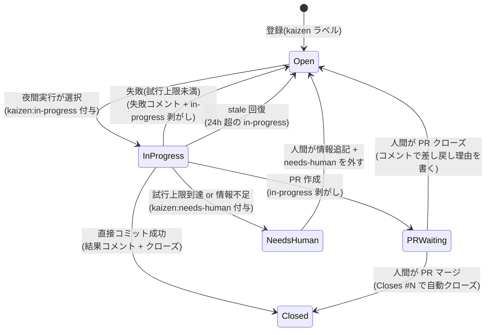

# 05. Issue 規約

Kaizen Loop は GitHub Issues を「改善のキュー」として使う。本ドキュメントはラベル体系・テンプレート・ライフサイクルを定める。

## 1. ラベル体系

`kaizen init` がすべて作成する(冪等)。

### 対象識別

| ラベル | 意味 |
|---|---|
| `kaizen` | **必須**。夜間メンテナンスの処理対象であることを示す。これが無い Issue には一切触れない |

### 優先度(任意・排他)

| ラベル | 意味 | 目安 |
|---|---|---|
| `kaizen:P0` | 最優先 | 利用がブロックされる・データを壊す |
| `kaizen:P1` | 高 | 主要機能の不具合・毎回遭遇する不便 |
| `kaizen:P2` | 通常(省略時のデフォルト扱い) | 軽微な不具合・改善・ドキュメント |

### 反映ポリシー指定(任意・排他)

| ラベル | 意味 |
|---|---|
| `kaizen:direct` | 検証が通れば直接コミットしてよい、という登録者の意思表示(保護パス・検証パスの要件は免除されない) |
| `kaizen:pr-only` | 必ず PR にする(機械判定より優先) |

### エージェント指定(任意・排他)

| ラベル | 意味 |
|---|---|
| `kaizen:agent:claude` | builder-agent へ Claude を希望バックエンドとして渡す |
| `kaizen:agent:codex` | builder-agent へ Codex を希望バックエンドとして渡す |

### 即時実行トリガー(任意)

| ラベル | 意味 |
|---|---|
| `kaizen:now` | Phase 4 予定の `kaizen watch` 常駐モード(→ [09-instant-run.md](./09-instant-run.md) §3.4)が検知して即時処理する。現行 CLI では自動処理されない |

### Goal 連携(オーケストレータが管理)

| ラベル | 意味 |
|---|---|
| `kaizen:goal` | `kaizen goal run` が作成した Goal-linked Issue。本文の `kaizen-loop:goal` marker で Goal state と紐づく |

### 状態(オーケストレータが管理。人間は原則触らない)

| ラベル | 付与者 | 意味 |
|---|---|---|
| `kaizen:in-progress` | オーケストレータ | 夜間処理中。24h 超で stale 扱い(→ [04-nightly-pipeline.md](./04-nightly-pipeline.md) §2) |
| `kaizen:needs-human` | オーケストレータ | 自動修正を断念(試行上限・情報不足)。**人間が対応し、解決したらこのラベルを外すと再び対象に戻る**。ただし、最新結果が外部実行環境由来の `retryableExternal: true` なら、ラベルが残っていても次回自動実行で再試行する |

## 2. Issue テンプレート

`kaizen init` が `.github/ISSUE_TEMPLATE/kaizen.yml` を生成する。GitHub の Web UI から登録する場合のフォーム。

```yaml
name: "🔄 Kaizen(改善依頼)"
description: 夜間メンテナンスエージェントに修正・改善を依頼する
labels: ["kaizen"]
body:
  - type: textarea
    id: problem
    attributes:
      label: 問題 / 改善したいこと
      description: 何が起きたか・何が不便か。エラーメッセージはそのまま貼る
    validations:
      required: true
  - type: textarea
    id: repro
    attributes:
      label: 再現手順
      description: 実行したコマンド・操作。再現できないと夜間エージェントは修正を断念しやすい
      placeholder: |
        1. `kaizen status --json` を実行
        2. ...
    validations:
      required: true
  - type: textarea
    id: expected
    attributes:
      label: 期待する動作
    validations:
      required: true
  - type: textarea
    id: scope
    attributes:
      label: 関係しそうな場所(任意)
      description: ファイル名・関数名・ログなど、わかる範囲で。夜間エージェントの調査時間を大きく節約できる
  - type: dropdown
    id: priority
    attributes:
      label: 優先度
      options: ["P2(通常)", "P1(高)", "P0(最優先)"]
      default: 0
```

> dropdown の優先度はテンプレートでは本文に残るだけなので、`kaizen report --priority` か手動ラベル付けを正とする。Web UI からの登録を主経路にする場合は GitHub Actions でのラベル自動付与を Phase 3 で検討(→ [08-roadmap.md](./08-roadmap.md))。

## 3. 良い Kaizen Issue の条件(利用側 AI への指示にも使う)

夜間エージェントは登録者に質問できない(非同期・無人)。したがって Issue は**単独で行動可能(self-contained & actionable)**である必要がある:

1. **再現手順が具体的**: コマンド・入力・環境
2. **期待と実際のギャップが明確**
3. **スコープが 1 つ**: 複数の問題は複数の Issue に分ける(1 Issue = 1 修正 = 1 コミット/PR)
4. **手がかりがある**: エラーメッセージ全文、関係するファイル名

利用側 AI エージェントが `kaizen report` で登録する際は、上記を満たす本文を生成すること(ターゲットプロジェクトの CLAUDE.md / AGENTS.md にこの規約を記載することを推奨。`kaizen init` が追記を提案する)。

## 4. Issue ライフサイクル



### 人間の関与ポイント(まとめ)

| 状況 | 人間がやること |
|---|---|
| PR ができている | レビューしてマージ(またはクローズ + 理由コメント) |
| `kaizen:needs-human` | Issue を読み、情報を追記するか自分で直す。再挑戦させるならラベルを外す |
| 直接コミットに問題があった | revert し、当該 Issue を `kaizen:pr-only` 付きで再オープン |

## 5. AI(利用側)からの登録経路

```sh
# 推奨: kaizen report(ラベル・書式が保証される)。登録だけなら queued 実行許可は付けない
echo "$STRUCTURED_BODY" | kaizen report "<タイトル>" --body-file - --priority P1 --json

# queued 実行に載せる場合は明示する
kaizen queue <Issue番号>

# 代替: gh CLI 直接(kaizen ラベルを必ず付けること。opt-in 運用で実行許可するなら kaizen:ready も付ける)
gh issue create --label kaizen --title "..." --body "..."
```

`kaizen` は Kaizen 管理対象であることを示す。`issues.selection.mode: opt-in` の場合、scheduled / backlog 実行に載せるには `issues.selection.includeLabel`(デフォルト `kaizen:ready`)が別途必要。Issue 登録 skill は、ユーザが「queue」「実行して」「kaizen-loop に載せて」と明示した場合だけ ready label を付ける。
